# Engineering Student Assistant 🎓✨

Welcome! **Engineering Student Assistant** is an all-in-one web application built for engineering students. It keeps your study schedules, college attendance, project ideas, exam plans, and interview preparation resources in one central place.

---

## ❓ Why Use This App?
As an engineering student, managing classes, attendance, assignments, projects, and preparing for job interviews can be overwhelming. This app solves that by organizing your daily student life, helping you boost your grades, and preparing you for your future career.

---

## 📦 What is Inside?

- **📊 Dashboard**: A quick overview of your college day, showing your attendance grades, upcoming exams, and helper study suggestions.
- **📚 Notes & Solved Papers**: Create, read, and download revision notes and past exam question papers.
- **📅 Study Planner**: Set up dynamic schedules and task checklists to prepare for tests.
- **🏫 College Companion**: Log your daily timetable, track subject attendance, and check the college notice board.
- **💼 Interview & Job Prep**: Log coding challenges, practice mock questions, and read real interview logs from seniors.
- **💡 Project Generator**: Find over 400 project ideas and get custom AI prompts (for ChatGPT, Claude, or Cursor) to build them.
- **🗺️ Career Roadmap**: Check off milestone goals to make sure you are ready for a job by graduation.

---

## 🖼️ Screenshots

### 📊 Dashboard
> Your personal command center. Get a quick overview of AI notes, PYQ questions, placements logged, and document exports. Features today's focus tracker, workspace modules, and an active study assistant.

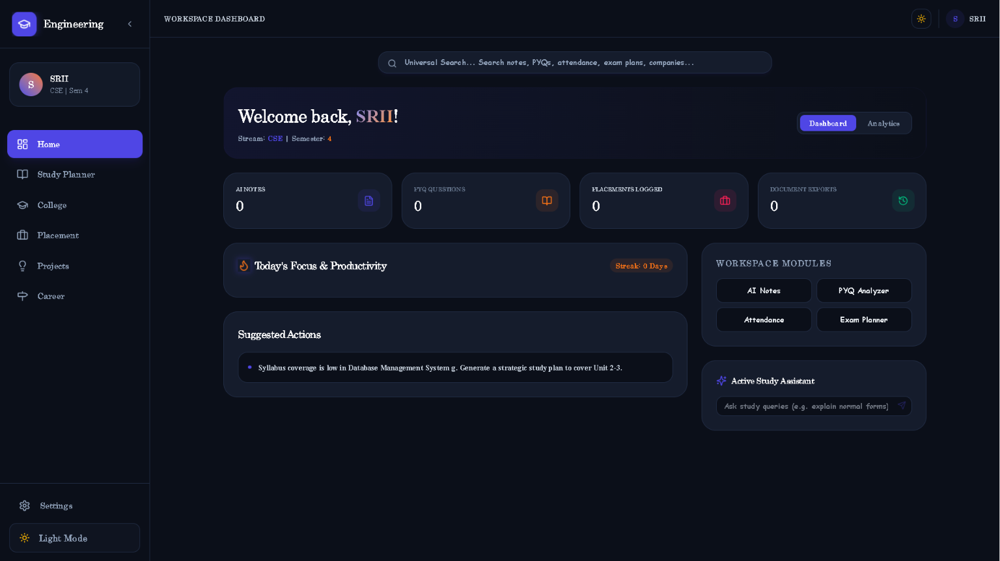

---

### 🌙 Dashboard – Light Mode
> The same powerful dashboard in a clean, minimal light theme — switch between dark and light mode anytime with a single click.

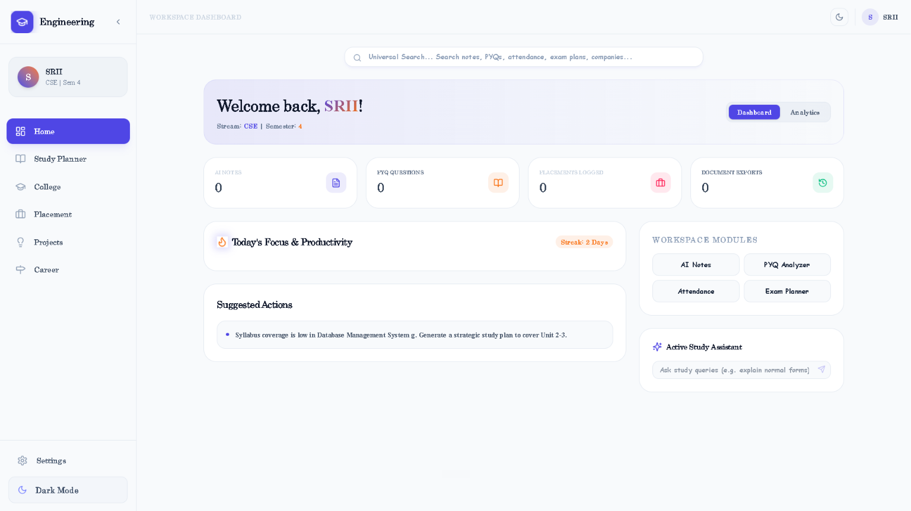

---

### 📅 Study Planner
> Smartly schedule your study tasks with subject selection, priority levels, and due dates. The AI Workload Advisor tells you exactly how many hours to study based on your upcoming exams.

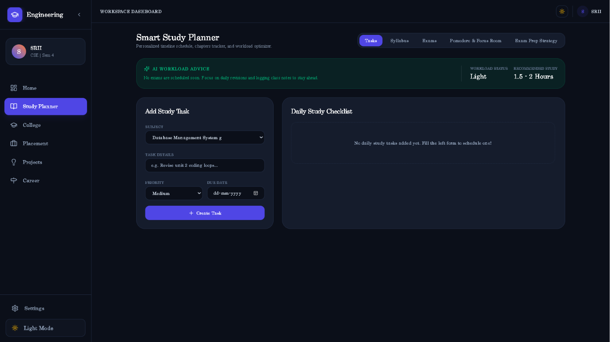

---

### 🏫 College Companion – Subjects
> Add and manage all your subjects with course codes, credits, CIE/SEE marks, and goal grades. Everything you need for your semester at a glance.

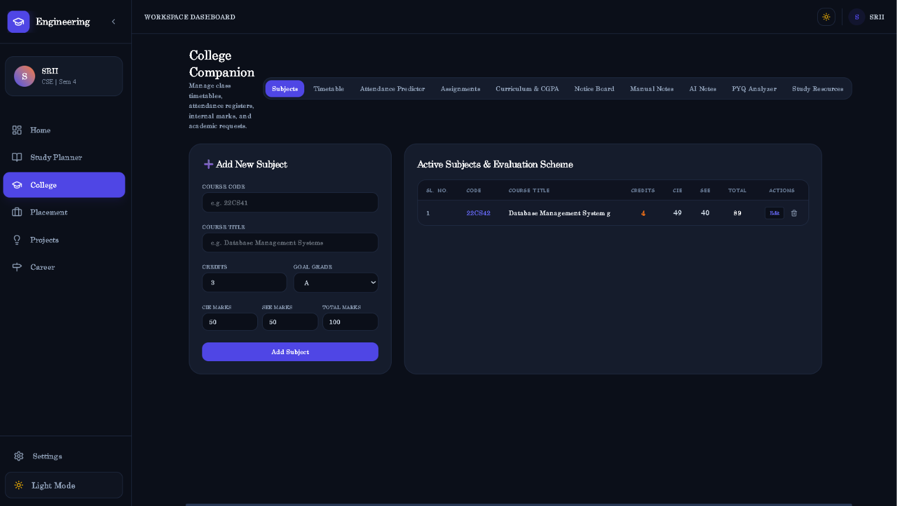

---

### ✅ College Companion – Attendance Predictor
> Track your attendance per subject in real time. The Active Absence Simulator lets you simulate future misses or attendances to see how they impact your overall percentage.

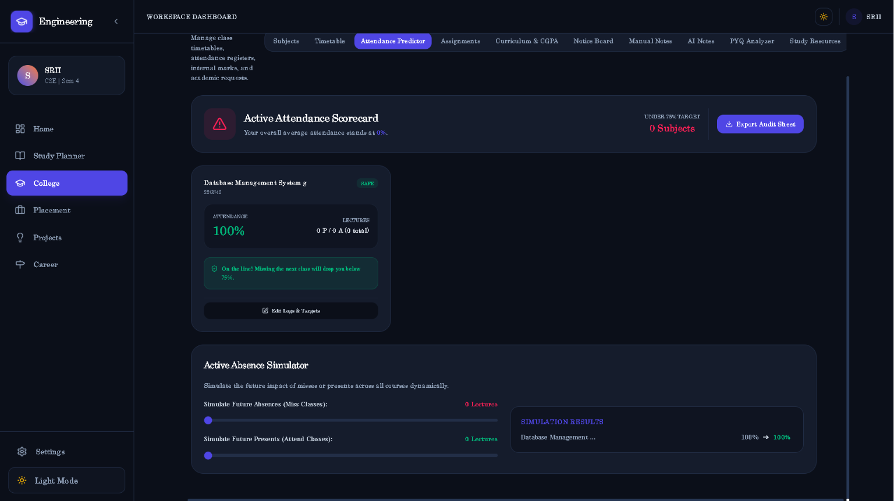

---

### 🎓 College Companion – Curriculum & CGPA
> View your full curriculum scheme with marks and credits. Calculate your SGPA for the current semester and track your cumulative CGPA across all semesters.

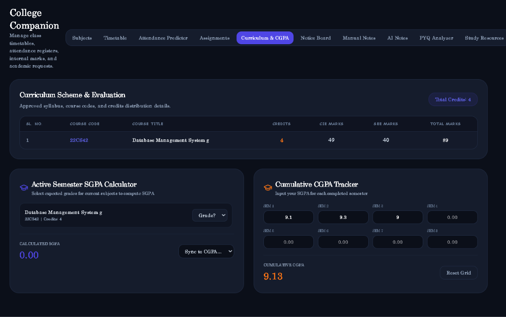

---

### 📢 College Companion – Notice Board
> Stay updated with department announcements, exam schedules, placement drives, and academic events — all in one organized notice board with an academic event calendar.

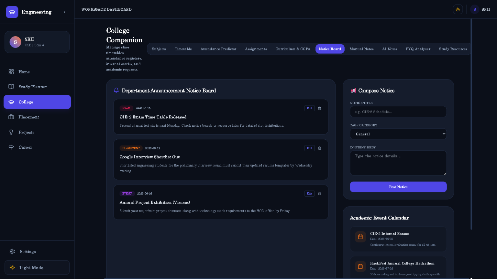

---

### 💼 Placement Training Hub – Daily Challenge
> Take on daily aptitude and coding challenges. Get instant scoring with accuracy and speed breakdown, and receive diagnosed weak topic reports to know exactly what to improve.

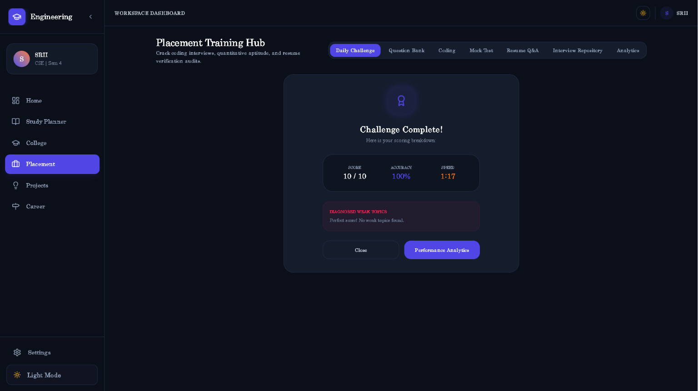

---

### 📖 Placement Training Hub – Question Bank
> Browse 175+ quantitative, verbal, and reasoning questions. Filter by category and difficulty, bookmark questions, and practice at your own pace.

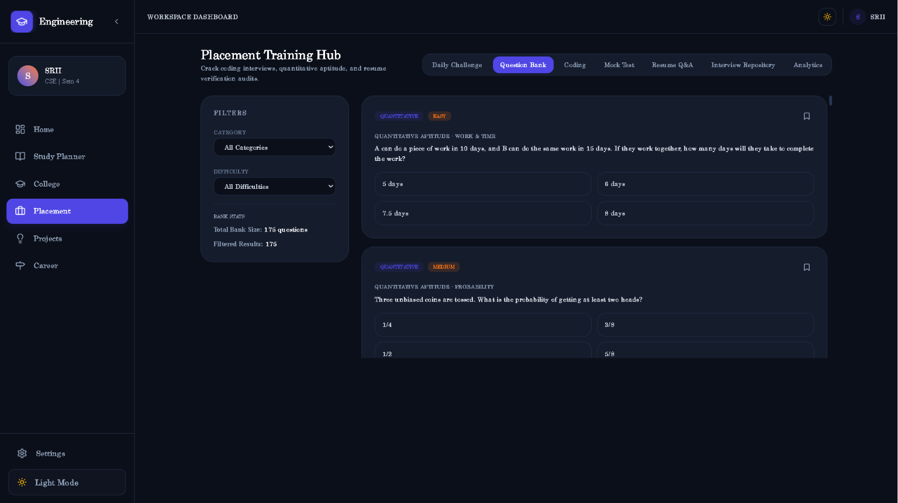

---

### 💡 Engineering Project Idea Generator
> Discover 400+ curated project ideas filtered by branch, difficulty, budget, team size, and tech stack. Save favorites and generate AI prompts for ChatGPT or Claude to build your project instantly.

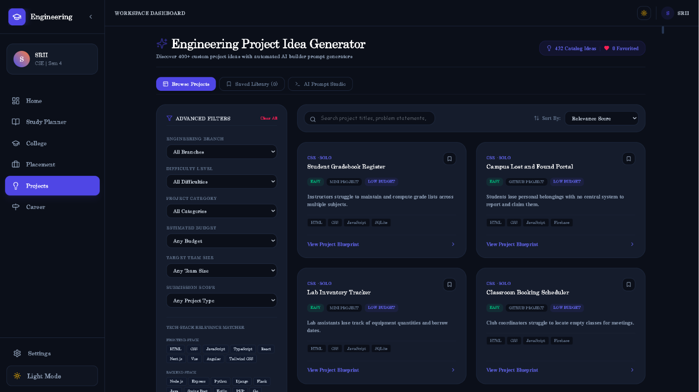

---

### 🗺️ Engineering Career Roadmap
> Explore semester-wise career tracks like Full Stack Developer, Data Scientist, DevOps Engineer, AI/ML Engineer, and more — complete with required skills and expected salary packages.

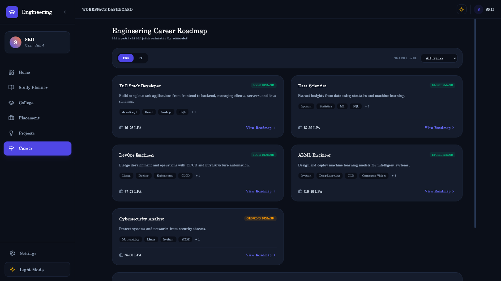

---

## 🛠️ Step-by-Step Installation Guide

To run this code on your computer, you need to install Node.js first. Here is how to set up everything:

### 1. Install Node.js & npm
Node.js runs the JavaScript code on your computer, and npm installs the project libraries.
- Go to the official website: [nodejs.org](https://nodejs.org/)
- Download the **LTS (Long Term Support)** version for your operating system (Windows/Mac/Linux).
- Run the installer and click "Next" until finished.
- To verify it is installed, open your terminal (Command Prompt or PowerShell on Windows) and type:
  ```bash
  node -v
  npm -v
  ```

---

## 🚀 How to Run the App

Once you have installed Node.js, open your terminal inside the project folder and run these commands:

1. **Install project packages**:
   ```bash
   npm install
   ```
2. **Start the development server**:
   ```bash
   npm run dev
   ```
3. Look at the terminal output; it will display a local web address. Copy and paste that address into your web browser to open the website!

---

## 🤍 Thank You

Thank you for taking a moment to explore Engineering Student Assistant. ✨

Built with passion, curiosity, and a commitment to helping engineering students stay organized, productive, and career-ready, this project represents countless hours of learning and development. 📚🚀

If you enjoyed exploring the project, consider giving it a ⭐. Every bit of support, feedback, and contribution is genuinely appreciated. 🙏

Thank you for visiting my GitHub and exploring this project. Your time, interest, and support are truly appreciated, and I hope you find something meaningful, useful, or inspiring here. ✨💙

---

## 💖 Thank You for Visiting!

> *"Thank you so much for taking the time to explore Engineering Student Assistant!"* 🌟

Taking your precious time to inspect this project, walk through the features, and review my code means the world to me. Every single repository I build is an opportunity to learn, innovate, and push the boundaries of software engineering.

- 🌟 **Enjoyed the project?** Feel free to leave a **Star** on this repository—your support provides immense motivation to keep building exciting projects!
- 📬 **Let's Connect:** I am always open to constructive feedback, technical discussions, and exciting engineering opportunities. Feel free to explore my other repositories or connect with me directly on [GitHub](https://github.com/SriniwasAwasthi).

*Wishing you a wonderful day ahead, and thank you once again for stopping by!* ✨

---

<div align="center">
  <sub>Crafted with passion by <a href="https://github.com/SriniwasAwasthi">Sriniwas Awasthi</a>.</sub>
</div>
